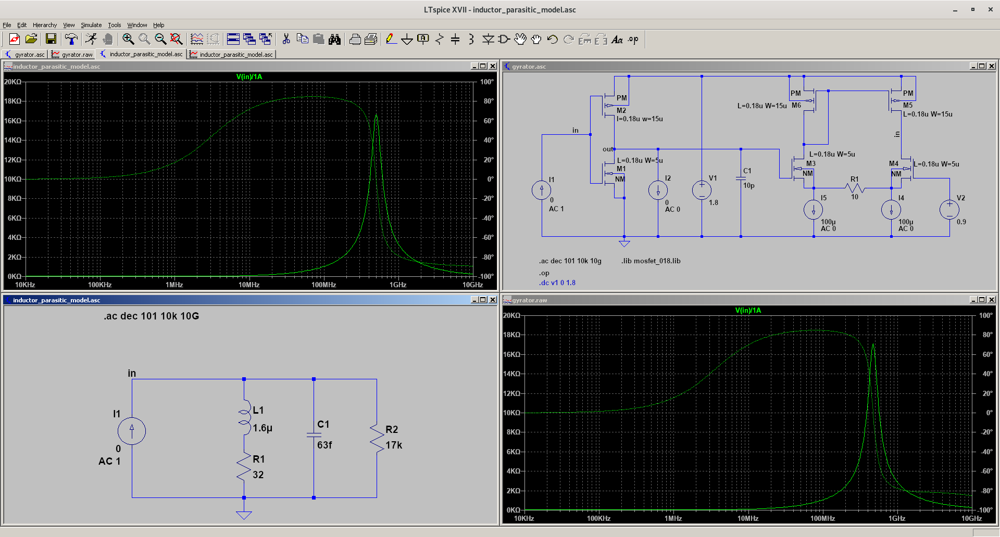

# gyrator
An active inductor using gyrator implementation in LTSpice

Credit: Jim Cassetta from Analog Devices, LTSpice Forum, and [eevblog forum](https://www.eevblog.com/forum/beginners/gyrator-circuit-discussion/) provide help in simulation
